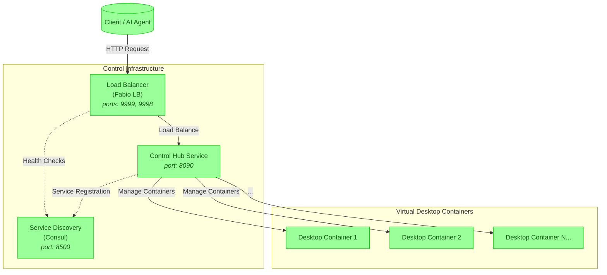

<div align="center">

<pre style="color: #3cb371">   
   ▄████████  ▄█        ▄██████▄   ▄█     █▄     ▄████████     ███        ▄████████     ███        ▄████████ 
  ███    ███ ███       ███    ███ ███     ███   ███    ███ ▀█████████▄   ███    ███ ▀█████████▄   ███    ███ 
  ███    █▀  ███       ███    ███ ███     ███   ███    █▀     ▀███▀▀██   ███    ███    ▀███▀▀██   ███    █▀  
 ▄███▄▄▄     ███       ███    ███ ███     ███   ███            ███   ▀   ███    ███     ███   ▀  ▄███▄▄▄     
▀▀███▀▀▀     ███       ███    ███ ███     ███ ▀███████████     ███     ▀███████████     ███     ▀▀███▀▀▀     
  ███        ███       ███    ███ ███     ███          ███     ███       ███    ███     ███       ███    █▄  
  ███        ███▌    ▄ ███    ███ ███ ▄█▄ ███    ▄█    ███     ███       ███    ███     ███       ███    ███ 
  ███        █████▄▄██  ▀██████▀   ▀███▀███▀   ▄████████▀     ▄████▀     ███    █▀     ▄████▀     ██████████ 
             ▀                                                                                               
</pre>

# CloudStar

### Enterprise-Grade Cloud Desktops for AI Agents & Collaborative Computing

[](https://hub.docker.com/r/shanurcsenitap/vnc_chrome_debug)
[](https://www.gnu.org/licenses/agpl-3.0)
[](https://github.com/codebanesr/orchestrator/actions)
[](https://github.com/codebanesr/orchestrator/wiki)
[](https://discord.gg/cloudstar)

</div>

## 🚀 Overview

CloudStar is a powerful, scalable platform for virtual Linux containers running full-featured desktops and browsers with complete external control. Our solution enables AI agents to interact with real desktop environments just like humans, while also offering collaborative capabilities for teams and individuals.

> **Featured On**: [Awesome-Containers List](https://github.com/awesome-containers) | **Demo**: [live.orchestrator.dev](https://live.orchestrator.dev)

## 🎯 Key Use Cases

### AI Desktop Agents
- **Autonomous Web Research**: AI agents with full browsing capabilities can research, summarize, and analyze web content
- **Visual Decision Making**: Agents can interact with visual interfaces, analyzing charts, graphs, and UI elements
- **Multi-step Workflows**: Agents can execute complex workflows across multiple applications
- **Automation Testing**: Build and test applications with AI agents that mimic real user behavior

### Collaborative Computing
- **Pair Programming**: Code together in real-time with shared terminal and IDE access
- **Interactive Presentations**: Give live demos with audience participation
- **Virtual Classroom**: Teach programming, design, or any digital skill with shared desktops
- **Co-browsing Customer Support**: Assist customers through shared browser sessions

### Entertainment & Community
- **Synchronized Movie Watching**: Watch films together with perfect synchronization
- **Collaborative Gaming**: Play browser games together or watch friends play
- **Virtual Watch Parties**: Create themed viewing rooms for TV shows, sports events, or conferences
- **Creative Collaboration**: Work on digital art, music production, or video editing together

### Enterprise Solutions
- **Secure Remote Work**: Provide isolated desktop environments that never store sensitive data locally
- **Compliance & Audit**: Record desktop sessions for regulatory compliance or training
- **Legacy Application Access**: Run legacy software in containers accessible from any device
- **Cross-platform Testing**: Test applications across multiple browser and OS configurations

## 🏗️ Architecture



## 💡 Features

<div align="center">

| Isolation & Control | Scalability | Monitoring & Security |
|---------------------|-------------|-----------------------|
|  Fully Isolated Containers |  Auto-scaling Clusters |  Real-time Metrics |
| **External Control** | **Enterprise Ready** | **Zero Trust Security** |
|  Remotely Managed Desktops & Browsers |  Multi-Node Support |  Mutual TLS & RBAC |

</div>

- **Ephemeral Environments**: Spin up disposable desktops in seconds, then destroy them without a trace
- **Full Desktop Access**: Complete Linux desktop environment with audio, video, and peripheral support
- **Collaborative Tools**: Built-in text, voice, and video chat for human-to-human or AI-to-human collaboration
- **Programmable Interface**: Control desktops via API or WebSocket for automation and integration
- **Resource Efficient**: Optimized containers use minimal resources while providing full desktop functionality
- **Cross-Platform**: Access from any device with a modern web browser - no client software needed

## 🚤 Quick Start

### Prerequisites
- Docker 20.10+
- Go 1.22+
- 4GB RAM (8GB recommended)
- Linux kernel >5.10

### Installation & Setup
```bash
# Clone with depth for a faster download
git clone --depth=1 https://github.com/codebanesr/orchestrator.git
cd orchestrator

# Install dependencies
go mod download

# Build and run using make commands
make swagger  # Generate Swagger documentation
make build    # Build the application
make run      # Run the application (includes swagger generation)
```

## ⚙️ Configuration

### 🔧 Environment Variables
| Variable | Description | Default |
|----------|-------------|---------|
| `WIDTH` | Width of the virtual desktop/browser window | `1024` |
| `HEIGHT` | Height of the virtual desktop/browser window | `768` |
| `LOG_LEVEL` | Logging verbosity level (debug, info, warn, error) | `debug` |
| `PORT` | Port on which the service will run | `3000` |
| `BEHIND_PROXY` | Whether the service is running behind a proxy | `false` |
| `CONSUL_HTTP_ADDR` | Address of the Consul service | `localhost:8500` |

### 🔌 Exposed Ports & Endpoints

| Service | Port | Access URL | Description |
|---------|------|------------|-------------|
| Orchestrator API | 8090 | `http://localhost:8090/` | Main control API for container management |
| Fabio Load Balancer | 9999 | `http://localhost:9999/` | HTTP traffic to containers |
| Fabio UI | 9998 | `http://localhost:9998/` | Fabio management interface |
| Consul | 8500 | `http://localhost:8500/` | Service discovery dashboard |
| Container noVNC | 6901 | `/{containerID}/novnc/` | Web-based VNC client |
| Container VNC | 5901 | `/{containerID}/vnc/` | Direct VNC server access |

## 🔒 Security
- **Zero Trust Architecture**: Mutual TLS between all components
- **Isolated Environments**: Each desktop runs in its own container with resource limits
- **Ephemeral Sessions**: No data persists after container termination
- **Secure Communication**: Encrypted WebRTC for audio/video and HTTPS for all traffic
- **Granular Permissions**: Role-based access control for all container operations

## 📚 Documentation
The API documentation is available via Swagger UI:
- When running behind proxy: `http://localhost:9999/orchestrator/swagger/`
- Direct access: `http://localhost:8090/swagger/`

## 🌐 Community & Support

- 📚 [Documentation](https://github.com/codebanesr/orchestrator/wiki)
- 💬 [Discord Community](https://discord.gg/cloudstar)
- 🐦 [Twitter](https://twitter.com/cloudstar)
- 📧 Enterprise Support: contact@orchestrator.dev

## 🤝 Contributing
We welcome contributions! Please read our [Contributing Guidelines](CONTRIBUTING.md) before submitting a pull request.

1. Fork the repository
2. Create your feature branch (`git checkout -b feature/AmazingFeature`)
3. Add tests for new functionality
4. Commit your changes (`git commit -m 'Add some AmazingFeature'`)
5. Push to the branch (`git push origin feature/AmazingFeature`)
6. Open a Pull Request

## 📜 License
This project is licensed under the AGPL v3 License - see the [LICENSE](LICENSE) file for details.

---

<div align="center">
  <sub>Built with ❤️ by Codebanesr | Inspired by <a href="https://github.com/m1k1o/neko">Neko</a></sub>
</div>